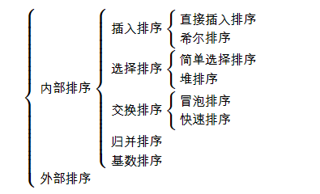

## 算法与数据结构  

#### 一、八大排序算法  
   1.[冒泡排序](./src/main/java/com/human/algorithmic/八大排序算法/A_冒泡排序/BubbleSort.md)  
   2.[选择排序](./src/main/java/com/human/algorithmic/八大排序算法/B_选择排序/SelectionSort.md)   
   3.[插入排序](./src/main/java/com/human/algorithmic/八大排序算法/C_插入排序/InsertSort.md) 
   4.[快速排序](./src/main/java/com/human/algorithmic/八大排序算法/D_快速排序/QuickSort.md) 
   5.[归并排序](./src/main/java/com/human/algorithmic/八大排序算法/E_归并排序/MergeSort.md) 
   6.[堆排序](./src/main/java/com/human/algorithmic/八大排序算法/F_堆排序/HeapSort.md) 
   7.[希尔排序](./src/main/java/com/human/algorithmic/八大排序算法/G_希尔排序/ShellSort.md) 
   8.[基数排序](./src/main/java/com/human/algorithmic/八大排序算法/H_基数排序/RadixSort.md)   
    
 它们都属于内部排序，也就是只考虑数据量较小仅需要使用内存的排序算法，他们之间关系如下：  
 
 
 
 稳定与非稳定:
 
    如果一个排序算法能够保留数组中重复元素的相对位置则可以被称为是 稳定 的。反之，则是 非稳定 的。
    
    